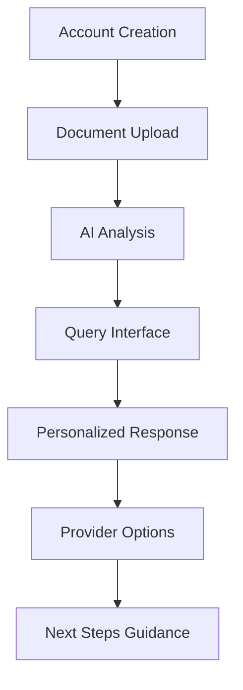

# Benefits Insight - Product Requirements Document (PRD)

## 📋 Executive Summary

**Benefits Insight** is a Progressive Web App (PWA) that empowers insurance customers to understand and maximize their benefits through an AI-powered conversational interface. Users upload their insurance policy documents, which are analyzed by AI to provide personalized guidance for medical needs, provider recommendations, and benefit optimization strategies.

**Product Vision**: Empower insurance customers with clear understanding of their complex benefits while helping them make informed healthcare decisions—without replacing licensed medical advice or automated scheduling systems.

---

## 🎯 Problem Statement

Insurance customers face significant challenges when navigating their benefits:

### Core Pain Points
- **Complex Documentation**: Insurance documents are lengthy and filled with jargon
- **Benefit Underutilization**: Customers miss opportunities to maximize their coverage
- **Lack of Personalization**: Generic information doesn't account for individual circumstances
- **Provider Discovery**: Difficulty finding in-network providers that maximize coverage

---

## 👥 Target Users

### Primary Users
- **Insurance Policyholders**: Individuals seeking to understand their benefits
- **Family Caregivers**: Managing healthcare for dependents

### Secondary Users
- **HR Professionals**: Helping employees navigate company benefits

---

## 🚀 Core Features

### 1. Document Analysis & Storage
- **Secure PDF Upload**: Support for insurance policy documents
- **AI-Powered Extraction**: Automated parsing of key policy details
- **Persistent Storage**: Analyzed benefits stored for future reference
- **Privacy-First Design**: Sensitive data kept on-device where possible

### 2. Conversational Interface
- **Natural Language Processing**: Understand user queries about benefits
- **Multi-Modal Input**: Voice and text input options
- **Contextual Responses**: Answers reference specific policy details
- **Clear Disclaimers**: Transparent about AI limitations and medical advice boundaries

### 3. Benefit Discovery & Maximization
- **Personalized Recommendations**: Based on individual policy coverage
- **Cost Transparency**: Clear explanation of coverage limits and out-of-pocket costs
- **Alternative Options**: Suggestions for covered care alternatives
- **Time-Sensitive Alerts**: Highlighting benefits like annual wellness visits

### 4. Provider Recommendations (MVP: Mock Data)
- **In-Network Suggestions**: Provider recommendations based on user needs
- **Cost Estimates**: Display estimated costs based on insurance coverage
- **Mock Database**: Integration with simulated provider data for hackathon demo
- **Future-Ready Architecture**: Framework for real provider API integration

### 5. Educational Resources
- **Plain-Language Explanations**: Insurance terminology made accessible
- **Scenario Guidance**: Help with common insurance situations
- **Life Event Tips**: Benefit optimization strategies for major life changes

---

## 🔄 User Journey

### Detailed Flow
1. **Onboarding**: User creates account and uploads insurance documents
2. **Document Processing**: AI analyzes and extracts key information
3. **Query Interface**: User asks questions about coverage or medical needs
4. **Personalized Response**: System provides policy-specific guidance
5. **Provider Options**: System suggests in-network providers (mock data for MVP)
6. **Follow-up Actions**: User receives guidance on next steps (no automatic scheduling)

---

## 🛠 Technical Requirements

### 1. Document Processing
- **PDF Parsing**: Support for various insurance document formats
- **OCR Capability**: Handle scanned physical documents
- **Secure Storage**: Encrypted document storage

### 2. AI Implementation
- **Local-First Processing**: Enhanced privacy through on-device processing
- **Medical Advice Boundaries**: Information provision, not diagnosis
- **Document Citation**: Ability to reference specific document sections

### 3. User Interface
- **Progressive Web App**: Cross-platform compatibility
- **Multi-Modal Input**: Voice and text options
- **Accessibility**: WCAG 2.1 compliance
- **Responsive Design**: Mobile and desktop optimization

### 4. Data Security
- **HIPAA-Aware Design**: Healthcare privacy principles
- **Data Minimization**: Collect only necessary information
- **Privacy Policy**: Clear consent mechanisms and user rights

---

## 🎯 MVP Scope (Hackathon)

### Core Functionality
- **Document Processing**: Support for 2-3 common insurance formats
- **Conversational Interface**: Basic Q&A about uploaded documents
- **Mock Provider Data**: Limited dataset for recommendations
- **Common Scenarios**: Benefit explanations for annual check-ups, specialist visits

### Success Metrics
- Document upload and parsing accuracy
- User query response relevance
- Provider recommendation quality
- User engagement with educational content

---

## 📊 Success Criteria

### Technical Metrics
- Document processing accuracy: >90%
- Query response time: <3 seconds
- System uptime: >99%

### User Experience Metrics
- User satisfaction score: >4.0/5.0
- Feature adoption rate: >70%
- User retention: >60% after 30 days

---

## 🔮 Future Roadmap

### Phase 2 (Post-Hackathon)
- Real provider API integration
- Advanced document format support
- Enhanced AI capabilities
- Mobile app development

### Phase 3 (Long-term)
- Integration with healthcare systems
- Advanced analytics and insights
- Enterprise features for HR teams
- International expansion

---

## ⚠️ Risk Mitigation

### Technical Risks
- **Document Format Complexity**: Start with common formats, expand gradually
- **AI Accuracy**: Implement human review for critical responses
- **Privacy Concerns**: Transparent data handling and user control

### Business Risks
- **Regulatory Compliance**: Consult legal experts on healthcare regulations
- **User Adoption**: Focus on clear value proposition and ease of use
- **Competition**: Differentiate through personalization and user experience

---

## 📝 Appendix

### Document Formats Supported (MVP)
- PDF insurance policies
- Explanation of Benefits (EOB) documents
- Summary of Benefits and Coverage (SBC)

### Mock Provider Data Structure
- Provider name and specialty
- Location and contact information
- Estimated costs based on insurance tier
- Availability and ratings

### Educational Content Categories
- Insurance terminology glossary
- Common medical procedure guides
- Life event benefit optimization
- Healthcare cost-saving strategies