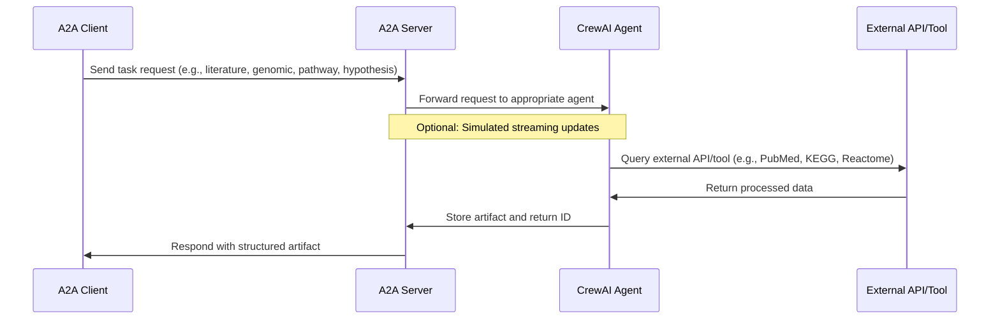

# CrewAI Multi-Agent A2A Server

This project implements a modular, professional multi-agent system for biomedical research, built with [CrewAI](https://www.crewai.com/open-source) and exposed through the A2A protocol. It is designed for tasks such as literature surveillance, genomic data extraction, pathway analysis, and hypothesis synthesis, using advanced LLMs and external APIs. The system is part of the [HackLab-Bio](https://github.com/palmedicoai/hacklab-bio/) initiative.


## How It Works

The agents in this system leverage CrewAI and advanced external APIs to perform specialized biomedical tasks. Each agent receives standardized requests via the A2A protocol, processes the task using its domain-specific tools, and returns structured artifacts to the client. This modular approach enables seamless orchestration and integration of literature surveillance, genomic data extraction, pathway analysis, and hypothesis synthesis.



## Project Structure

```
├── src/
│   ├── agent.py                # All agent class definitions (literature, genomic, pathway, hypothesis)
│   ├── agent_executor.py       # Executors for each agent, handling A2A requests
│   ├── tools.py                # Tool functions for PubMed, arXiv, Google Scholar, KEGG, Reactome
│   ├── main_genomic.py         # Entrypoint for Genomic Consultation Agent
│   ├── main_hypothesis.py      # Entrypoint for Hypothesis Synthesizer Agent
│   ├── main_literature.py      # Entrypoint for Literature Surveillance Agent
│   └── main_pathway.py         # Entrypoint for Pathway Analysis Agent
├── docker/
│   ├── docker-compose.yml      # Multi-service Docker Compose for all agents
│   └── Dockerfile              # Python image for running any agent
├── README.md                   # Project documentation (this file)
├── pyproject.toml              # Python dependencies and project config
├── uv.lock                     # Lock file for reproducible installs
└── .env                        # Environment variables (not included by default)
```

## Agents Overview

- **LiteratureSurveillanceAgent**: Searches and synthesizes scientific articles from PubMed, arXiv, and Google Scholar.
- **GenomicConsultationAgent**: Extracts genomic and regulatory data from longevity-related MCP servers.
- **PathwayAnalysisAgent**: Maps genes to biological pathways and biomarkers using KEGG and Reactome APIs.
- **HypothesisSynthesizerAgent**: Integrates artifacts from other agents to generate new, plausible, and verifiable research hypotheses.

## Tools

The system provides specialized tools for each agent:

- `pubmed_tool`: Search PubMed for articles using NCBI E-utilities API.
- `arxiv_tool`: Search arXiv for scientific articles.
- `google_scholar_tool`: Search Google Scholar using the `scholarly` Python package.
- `kegg_tool`: Query KEGG REST API for gene-pathway relationships.
- `reactome_tool`: Query Reactome REST API for gene-pathway relationships.

## How to Run

### Prerequisites

- Python 3.11 or higher
- [uv](https://docs.astral.sh/uv/) (recommended) or pip
- Google API Key (for Gemini access) or Vertex AI credentials

### Local Development

1. Install dependencies:
   ```bash
   uv pip install -r pyproject.toml
   # o bien
   pip install -r requirements.txt
   ```
2. Set your environment variables in a `.env` file:
   ```bash
   echo "GOOGLE_API_KEY=your_api_key_here" > .env
   ```
3. Run any agent from the project root:
   ```bash
   python -m src.main_pathway
   python -m src.main_genomic
   python -m src.main_literature
   python -m src.main_hypothesis
   ```

### Docker Compose

1. Build and run all agents as services:
   ```bash
   docker-compose --env-file .env  -f docker/docker-compose.yml up --build
   ```
   Each service will be available on its respective port (7000-7003 by default).

### Dockerfile (Single Agent)

You can also build and run a single agent container:
```bash
docker build -f docker/Dockerfile -t crewai-a2a-server .
docker run -p 7003:7003 -e GOOGLE_API_KEY=your_api_key_here crewai-a2a-server
```
By default, this runs the Pathway Analysis Agent. You can override the command to run another agent:
```bash
docker run -p 7000:7000 -e GOOGLE_API_KEY=your_api_key_here crewai-a2a-server python -m src.main_genomic --host 0.0.0.0 --port 7000
```

## Example Use Case

1. Start the desired agent (e.g., Pathway Analysis) as above.
2. Send an A2A protocol request to the agent's endpoint (see A2A documentation for client details).
3. The agent will use its tools to process the request and return structured results.

## Features

- Modular, professional Python project structure
- Multi-agent orchestration for biomedical research
- Integration with PubMed, arXiv, Google Scholar, KEGG, Reactome
- Docker and Docker Compose support for easy deployment
- Environment variable support for API keys and configuration

## Limitations

- No true streaming (CrewAI does not natively support it)
- Some tools depend on public APIs and may be rate-limited
- Requires valid API keys for LLM access

## References

- [CrewAI Documentation](https://docs.crewai.com/introduction)
- [A2A Protocol Documentation](https://a2a-protocol.org)
- [Google Gemini API](https://ai.google.dev/gemini-api)
- [KEGG API](https://www.kegg.jp/kegg/rest/keggapi.html)
- [Reactome API](https://reactome.org/ContentService/)
